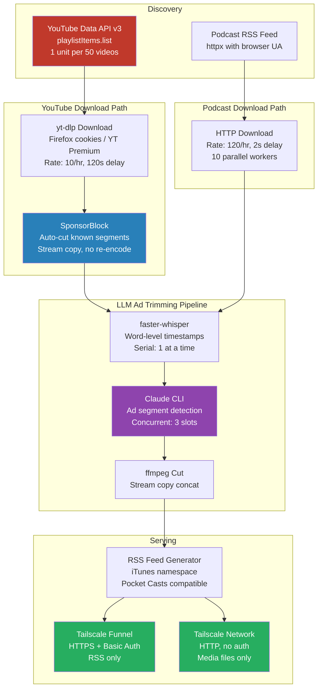

# Siphon

Self-hosted podcast pipeline that downloads YouTube channels and podcast feeds, strips ads using SponsorBlock + LLM analysis (Whisper + Claude), and serves clean RSS feeds to your podcast app over Tailscale.

Built for a very specific stack: **Windows gaming rig, Tailscale Funnel, Pocket Casts, Claude Code (Max subscription), Firefox cookies for YouTube Premium**. It works great for that. If your setup is different, expect to adapt.

## What it does

- **YouTube channels** &rarr; downloads videos via yt-dlp with your Firefox YouTube Premium session, applies SponsorBlock cuts, runs Whisper transcription + Claude ad detection for anything SponsorBlock missed, serves as a podcast feed
- **Podcast feeds** &rarr; downloads audio from RSS, runs Whisper + Claude to detect and cut sponsor reads/promos/self-promotion, serves a clean RSS feed
- **Web UI** at `localhost:8585/ui/` for feed management, OPML import, activity monitoring
- **System tray icon** for pause/resume/quit (runs at below-normal CPU priority for gaming)
- **Tailscale Funnel** for HTTPS RSS serving to Pocket Casts, media served over Tailnet only (no auth needed on your network)

## Architecture



### How Claude processes ads

1. **Whisper** transcribes the audio with word-level timestamps (~500 words/minute)
2. Claude receives a dual-format transcript:
   - **Segments** (coarse, for understanding context): `[0:00-0:45] Welcome to the show...`
   - **Word timestamps** (precise, for cut points): `0.00 Welcome  0.31 to  0.45 the...`
3. Claude identifies ad segments with start/end times and confidence scores
4. Segments above the confidence threshold are cut via ffmpeg stream copy
5. Episodes only appear in RSS after LLM processing completes (no race with podcast app auto-download)

For episodes longer than 45 minutes, word timestamps are omitted to stay within context limits (configurable).

### YouTube rate limiting

- **API discovery**: `playlistItems.list` at 1 unit per 50 videos (10,000 units/day free = 500,000 videos)
- **Downloads**: 10/hour with 120-second delay between each (configurable)
- **SponsorBlock delay**: configurable per feed (default 1 day, lets segments get crowdsourced)
- **API quota cooldown**: on 403, all YouTube API pauses for 4 hours (configurable)

### Podcast rate limiting

- **Downloads**: 120/hour, 2-second delay, 10 parallel workers
- **30 feeds checked per cycle** (vs 10 for YouTube)

## Setup

### Prerequisites

- Python 3.11+
- ffmpeg on PATH
- Deno on PATH (for yt-dlp's YouTube challenge solver)
- [Tailscale](https://tailscale.com/) with Funnel enabled and MagicDNS + HTTPS certs
- [YouTube Data API v3](https://console.cloud.google.com/apis/api/youtube.googleapis.com) key
- Firefox with YouTube Premium logged in (for cookies)
- Claude Code CLI on PATH (Max subscription)

### Install

```bash
git clone https://github.com/cwilliams5/Siphon.git
cd Siphon
pip install -e .
```

### Configure

Copy `config.example.yaml` to your data directory (outside the repo):

```bash
mkdir F:\Singularity\siphon
cp config.example.yaml F:\Singularity\siphon\config.yaml
```

Edit the config with your Tailscale hostname, auth credentials, YouTube API key, and feed list.

### Run

```bash
python -m siphon -c "F:\Singularity\siphon\config.yaml"
```

Or create a batch file for windowless operation:

```batch
@echo off
set PATH=%PATH%;C:\Users\you\.deno\bin
cd /d "path\to\Siphon"
pythonw -m siphon -c "F:\Singularity\siphon\config.yaml"
```

Use `--verbose` flag for console output. Use `--no-tray` to disable the system tray icon.

### Tailscale Funnel

```bash
tailscale funnel --bg 8585
```

RSS feeds are served over HTTPS with Basic Auth. Media files are served over Tailnet only (no auth, requires Tailscale on your phone).

### Pocket Casts

1. Copy the RSS URL from the web UI (includes embedded auth credentials)
2. Submit at [pocketcasts.com/submit](https://pocketcasts.com/submit) as a private feed
3. Save the `pca.st/private/...` URL back in the feed's settings

## Web UI

Available at `http://localhost:8585/ui/` (localhost only, no auth).

- Add/edit/delete feeds with all configuration options
- OPML import for bulk podcast migration
- Per-feed stats: In RSS, LLM Queue, DL Queue, SB/LLM cut counts
- Activity log with live status updates
- YouTube cookie/login test
- "Mark as Caught Up" button (sets date cutoff to today, deletes files)
- "Check Feeds Now" triggers immediate check + download cycle

## Key config options

| Section | Key | Default | Description |
|---------|-----|---------|-------------|
| `youtube` | `api_key` | required | YouTube Data API v3 key |
| `youtube` | `quota_cooldown_hours` | `4` | Hours to pause after API 403 |
| `schedule` | `check_interval_minutes` | `30` | How often to check for new episodes |
| `schedule` | `youtube_max_downloads_per_hour` | `10` | YouTube download rate limit |
| `schedule` | `podcast_max_downloads_per_hour` | `120` | Podcast download rate limit |
| `defaults` | `sponsorblock_delay_minutes` | `4320` | Wait for SB segments to be crowdsourced |
| `defaults` | `llm_trim` | `false` | Enable Whisper + Claude ad detection |
| `llm` | `claude_concurrency` | `3` | Parallel Claude CLI invocations |
| `llm` | `whisper_model` | `base` | Whisper model size (tiny/base/small/medium/large) |
| `llm` | `claude_effort` | `medium` | Claude thinking depth (low/medium/high/max) |
| `llm` | `word_timestamps_max_minutes` | `45` | Max episode length for word-level timestamps |
| `storage` | `max_disk_gb` | `1000` | Auto-prune oldest episodes when exceeded |

Per-feed overrides available for most settings. See `config.example.yaml`.
