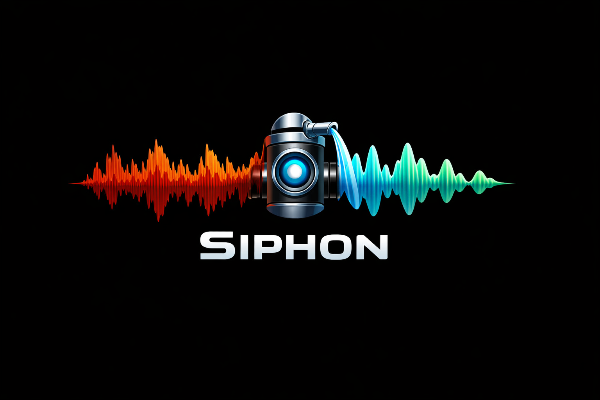
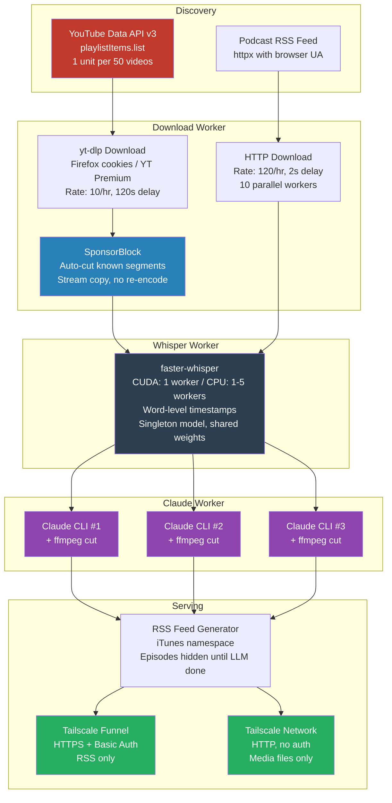

<p align="center">
  
</p>

# Siphon

Self-hosted podcast pipeline that downloads YouTube channels and podcast feeds, strips ads using SponsorBlock + LLM analysis (Whisper + Claude), and serves clean RSS feeds to your podcast app over Tailscale.

Built for a very specific stack: **Youtube API key, Tailscale Funnel, Pocket Casts, Claude Code (Max subscription), Firefox cookies for YouTube Premium**. It works great for that. If your setup is different, expect to adapt.

## What it does

- **YouTube channels** &rarr; discovers videos via YouTube Data API v3, downloads via yt-dlp with your Firefox YouTube Premium session, applies SponsorBlock cuts, runs Whisper transcription + Claude ad detection, serves as a podcast feed
- **Podcast feeds** &rarr; downloads audio from RSS, runs Whisper + Claude to detect and cut sponsor reads/promos/self-promotion, serves a clean RSS feed
- **Three-queue pipeline** &rarr; Download &rarr; Whisper &rarr; Claude, each running independently with their own scheduling and concurrency
- **Web UI** at `localhost:8585/ui/` for feed management, OPML import, live activity monitoring, stats dashboard with insights
- **System tray icon** for pause/resume/quit with adjustable Whisper workers (runs at below-normal CPU priority)
- **Tailscale Funnel** for HTTPS RSS serving to Pocket Casts, media served over Tailnet only (no auth needed on your network)
- **Auto-ban** for vulnerability scanners (fail2ban-style IP blocking)

## Architecture



### Three-queue pipeline

The pipeline uses three independent workers, each running on their own schedule:

| Worker | Interval | Concurrency | What it does |
|--------|----------|-------------|-------------|
| **Download** | 5 min | Sequential (rate limited) | Downloads media, applies SponsorBlock for YouTube |
| **Whisper** | 30 sec | CUDA: 1 / CPU: 1-5 (configurable) | Transcribes audio with word-level timestamps. Singleton model, shared weights. |
| **Claude** | 30 sec | 3 concurrent (configurable) | Detects ad segments, applies ffmpeg cuts |

Episodes flow through: `eligible` &rarr; `downloading` &rarr; `pending_whisper` &rarr; `pending_claude` &rarr; `done`

Episodes only appear in RSS after the full pipeline completes. Feeds without LLM trim skip directly to `done`.

### How Claude processes ads

1. **Whisper** transcribes the audio with word-level timestamps (CUDA: ~30s, CPU: ~5min per episode)
2. Claude receives a dual-format transcript:
   - **Segments** (coarse, for understanding context): `[0:00-0:45] Welcome to the show...`
   - **Word timestamps** (precise, for cut points): `0.00 Welcome  0.31 to  0.45 the...`
3. Claude identifies ad segments with start/end times and confidence scores
4. Segments above the confidence threshold are cut via ffmpeg stream copy
5. Per-episode metrics recorded: whisper time, claude time, ffmpeg time, word count, device used

For episodes longer than 45 minutes, word timestamps are omitted to stay within context limits (configurable).

### How ffmpeg cuts work

Claude returns all ad segments with timestamps referencing the **original file**. Rather than cutting sequentially (which would shift timestamps after each cut), ffmpeg inverts the cut list into keep-ranges:

1. Sort all ad segments by start time and merge overlaps
2. Invert to get the **keep ranges** — the gaps between ads
3. Extract each keep range from the original file with `-ss`/`-to` and `-c copy` (stream copy, no re-encode)
4. Concatenate all kept pieces via ffmpeg concat demuxer

Every extraction reads from the untouched original, so timestamps never shift. The entire operation is stream-copy — no audio/video re-encoding, so it's fast regardless of file size.

### YouTube integration

- **Discovery**: YouTube Data API v3 `playlistItems.list` at 1 unit per 50 videos (500,000 videos/day capacity)
- **First check**: pages backwards through entire channel until `date_cutoff` — one-time cost
- **Subsequent checks**: pages backwards until hitting a known video — typically 1-2 API calls
- **Quota cooldown**: on 403, all YouTube API calls pause for configurable hours (default 4)
- **Downloads**: yt-dlp with Firefox cookie integration for YouTube Premium, rate limited at 10/hr
- **SponsorBlock**: segments counted and tracked per episode for insights

### Podcast integration

- **Downloads**: 120/hour, 2-second delay, 10 parallel workers
- **30 feeds checked per cycle** (vs 10 for YouTube)
- **Browser User-Agent** for hosts that block default Python agents
- **Artwork**: pulled from RSS `<itunes:image>` and served in generated feeds

## Setup

### Prerequisites

- Python 3.11+
- ffmpeg on PATH
- Deno on PATH (for yt-dlp's YouTube challenge solver)
- [Tailscale](https://tailscale.com/) with Funnel enabled and MagicDNS + HTTPS certs
- [YouTube Data API v3](https://console.cloud.google.com/apis/api/youtube.googleapis.com) key
- Firefox with YouTube Premium logged in (for cookies)
- Claude Code CLI on PATH (Max subscription)
- NVIDIA GPU (optional, for CUDA-accelerated Whisper — requires `nvidia-cublas-cu12` and `nvidia-cudnn-cu12`)

### Install

```bash
git clone https://github.com/cwilliams5/Siphon.git
cd Siphon
pip install -e .

# For CUDA Whisper acceleration (optional):
pip install nvidia-cublas-cu12 nvidia-cudnn-cu12
```

### Configure

Copy `config.example.yaml` to your data directory (outside the repo — keep secrets out of git):

```bash
mkdir /path/to/siphon-data
cp config.example.yaml /path/to/siphon-data/config.yaml
```

Edit the config with your Tailscale hostname, auth credentials, YouTube API key, and feed list.

### Run

```bash
python -m siphon -c "/path/to/siphon-data/config.yaml"
```

Or create a batch file for windowless operation (Windows):

```batch
@echo off
set PATH=%PATH%;C:\Users\you\.deno\bin
cd /d "path\to\Siphon"
pythonw -m siphon -c "path\to\siphon-data\config.yaml"
```

Use `--verbose` flag for console output. Use `--no-tray` to disable the system tray icon.

### Tailscale Funnel

```bash
tailscale funnel --bg 8585
```

RSS feeds are served over HTTPS with Basic Auth. Media files are served over Tailnet only (no auth, requires Tailscale on your phone).

### Pocket Casts

1. Copy the RSS URL from the web UI (includes embedded auth credentials)
2. Submit at [pocketcasts.com/submit](https://pocketcasts.com/submit) as a private feed
3. Save the `pca.st/private/...` URL back in the feed's settings

## Web UI

Available at `http://localhost:8585/ui/` (localhost only, no auth). Three themes: Light, Dark, Black.

- **Dashboard** with system stats, lifetime metrics, and insights (most stale feeds, disk hogs, longest processing, cut stats)
- **Feed management** — add/edit/delete feeds with all per-feed config options, type-aware forms (YouTube vs podcast)
- **OPML import** for bulk podcast migration from Pocket Casts or other apps
- **Live activity log** in sticky footer with queue status, worker activity, and timing
- **Sort & filter** — by name, latest, most cuts; filter by YouTube, Podcast, LLM, SponsorBlock
- **Search** — instant feed search from the header
- **Per-feed stats** — In RSS count, queue depths, SB/LLM cut totals
- **Mark as Caught Up** — trims to 1 episode, sets date cutoff, cleans disk

## System Tray

- **Pause/Resume** — three-state (Running / Pending Pause / Paused) with graceful drain
- **Whisper workers** — adjustable (1-5, for live system use vs overnight processing)
- **Test YouTube Login** — verify Firefox cookie status
- **Open Config** — launch web UI

## Key config options

| Section | Key | Default | Description |
|---------|-----|---------|-------------|
| `youtube` | `api_key` | required | YouTube Data API v3 key |
| `youtube` | `quota_cooldown_hours` | `4` | Hours to pause after API 403 |
| `server` | `timezone` | `America/Los_Angeles` | Timezone for activity log timestamps |
| `server` | `media_base_url` | `""` | Tailnet-internal URL for media files |
| `schedule` | `check_interval_minutes` | `30` | How often to check for new episodes |
| `schedule` | `youtube_max_downloads_per_hour` | `10` | YouTube download rate limit |
| `schedule` | `podcast_max_downloads_per_hour` | `120` | Podcast download rate limit |
| `defaults` | `sponsorblock_delay_minutes` | `4320` | Wait for SB segments to be crowdsourced |
| `defaults` | `llm_trim` | `false` | Enable Whisper + Claude ad detection |
| `llm` | `whisper_model` | `base` | Whisper model size (tiny/base/small/medium/large) |
| `llm` | `whisper_device` | `cpu` | Whisper device (`cpu` or `cuda`) |
| `llm` | `whisper_workers` | `1` | Concurrent Whisper workers (CPU only, CUDA forced to 1) |
| `llm` | `claude_concurrency` | `3` | Parallel Claude CLI invocations |
| `llm` | `claude_model` | `claude-sonnet-4-6` | Claude model for ad detection |
| `llm` | `claude_effort` | `medium` | Claude thinking depth (low/medium/high/max) |
| `llm` | `word_timestamps_max_minutes` | `45` | Max episode length for word-level timestamps |
| `llm` | `confidence_threshold` | `0.75` | Minimum confidence to cut a detected segment |
| `storage` | `max_disk_gb` | `1000` | Auto-prune oldest episodes when exceeded |

Per-feed overrides available for most settings. See `config.example.yaml`.

## Metrics & observability

Per-episode metrics tracked in SQLite:
- `whisper_duration_seconds`, `claude_duration_seconds`, `ffmpeg_duration_seconds`
- `whisper_word_count`, `whisper_segment_count`, `transcript_size_bytes`
- `whisper_model`, `whisper_device` (CPU vs CUDA comparison)
- `llm_cuts_applied`, `sb_cuts_applied`
- `filter_reason` (too_old, too_short, short, title_match)

Dashboard insights computed from these metrics: most stale feeds, disk usage by feed, longest processing episodes, highest cut rates, highest filter rates.
